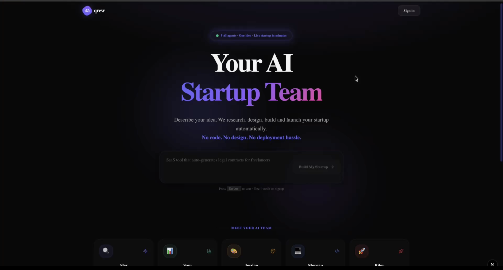
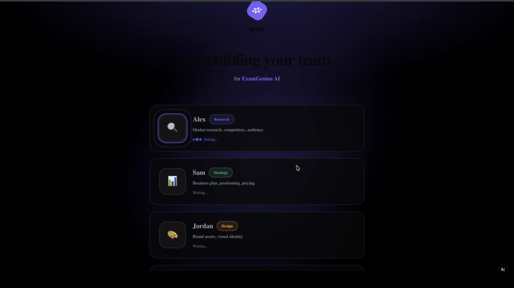
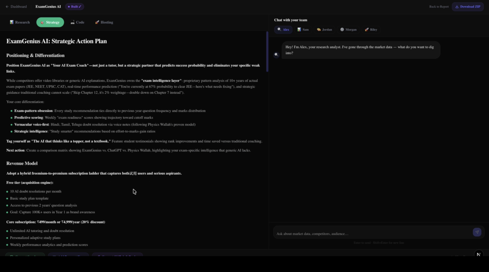
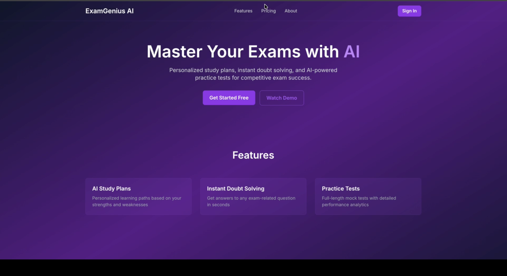

# Qrew — Your AI Founding Team

**Describe your idea. We research, build, and run your company.**

[](https://nextjs.org/)
[](https://www.typescriptlang.org/)
[](https://supabase.com/)
[](https://www.anthropic.com/)
[](https://www.ibm.com/)

> **Built for the IBM Bob Hackathon 2026** — IBM Bob was used as the primary development partner across 15 sessions, powering everything from architecture decisions to UI redesigns and agent prompt engineering.

---

## The Problem

90% of solo founders fail not because of bad ideas — but because of execution gaps.

- Hiring a full team costs **$50K–$200K/year**
- Freelancers are slow, inconsistent, and expensive
- No-code tools still require design thinking, strategy, and technical knowledge
- Founders waste months on research and planning before writing a single line of product code

---

## The Solution

## Screenshots






Qrew gives every solo founder a complete AI founding team. Describe your startup idea — five specialized agents get to work immediately, in parallel, and deliver a fully researched, strategized, designed, and deployed startup in one session.

---

## Meet Your AI Team

| Agent | Role | Powered By | Output |
|-------|------|-----------|--------|
| **Alex** | Research | Tavily API | Market analysis, competitor landscape, audience insights |
| **Sam** | Strategy | Claude Sonnet 4.6 | Business plan, positioning, pricing, 90-day GTM roadmap |
| **Jordan** | Design | Fal.ai Flux | Brand identity, colors, fonts, hero images |
| **Morgan** | Dev | v0 SDK + Claude | Full Next.js codebase — landing, auth, dashboard, payments |
| **Riley** | Launch | GitHub API + Vercel | Push to GitHub, deploy to Vercel, deliver live URL |

---

## How IBM Bob Powered This Build

IBM Bob was our AI development partner across **15 sessions** throughout the Qrew build. Bob wasn't just autocomplete — it was a genuine development collaborator.

**What Bob helped us build:**
- Architected the multi-agent orchestration pipeline
- Designed and debugged the streaming agent output system
- Completely redesigned the UI for the hackathon demo
- Fixed the build screen and removed the IDE panel
- Debugged Morgan's self-correction logic for code generation
- Engineered the agent prompts for Alex and Sam's reports
- Wrote the README and cleaned up the final submission

All Bob session exports are available in the `/bob_sessions` folder in this repository, as required by the hackathon guidelines.

---

## Demo Flow

1. **Describe your idea** — type any startup concept on the landing page
2. **Name generation** — Qrew names your startup and identifies category, audience, and vibe
3. **Team assembly** — Alex, Sam, Jordan, Morgan, and Riley join your founding team
4. **Research + Strategy** — Alex and Sam work in parallel, generating full reports in minutes
5. **Build** — Jordan creates brand assets, Morgan generates the complete codebase with self-correction
6. **Launch** — Riley pushes to GitHub and deploys to Vercel
7. **Company HQ** — Chat with any agent, view reports, download ZIP, connect your own infrastructure

---

## What's Working

- Google OAuth → Dashboard
- Idea input → Gemini name/industry extraction
- Team assembly animation
- Alex research reports (Tavily, high quality)
- Sam strategy reports (Claude Sonnet, high quality)
- PDF export for both reports
- Jordan brand identity (Fal.ai Flux images, colors, fonts)
- Morgan code generation (v0 SDK + Claude)
- Morgan self-correction on generated code
- Riley GitHub push + Vercel redirect
- ZIP download — complete Next.js project
- Company HQ — reports, code viewer, hosting, agent chat
- Credits system — balance, deduction, buy credits modal
- Connect Supabase OAuth flow
- Stripe + Razorpay key input

---

## Tech Stack

| Layer | Technology |
|-------|-----------|
| Framework | Next.js 14.2.5 |
| Styling | Tailwind CSS + Shadcn/ui |
| Animations | Framer Motion |
| Auth | Supabase + Google OAuth |
| Database | Supabase (Postgres) |
| AI Research | Tavily API (Alex) |
| AI Strategy | Claude Sonnet 4.6 (Sam) |
| AI Name/MCQ | Gemini Flash (Jordan) |
| AI Images | Fal.ai Flux Schnell (Jordan) |
| AI Frontend | v0 SDK (Morgan) |
| AI Backend | Claude Sonnet (Morgan) |
| Payments | Dodo Payments + Razorpay |
| Deployment | Vercel |

---

## Business Model

Credit-based consumption pricing:

| Package | Credits | Price | Per Credit |
|---------|---------|-------|-----------|
| Starter | 5 | $10 | $2.00 |
| Growth | 10 | $18 | $1.80 |
| Scale | 20 | $30 | $1.50 |

- Standard build: 1.5 credits (~$3)
- API cost per build: ~$0.80–$1.20
- Gross margin: ~60–70%
- Free tier: 10 credits on signup

---

## Getting Started

### Prerequisites

- Node.js 18+
- Supabase account
- Anthropic API key
- Tavily API key
- Fal.ai API key
- Google OAuth credentials

### Installation

```bash
git clone https://github.com/Khatribhavesh05/Qrew.git
cd Qrew
npm install
```

### Environment Variables

Create a `.env.local` file:

```env
NEXT_PUBLIC_SUPABASE_URL=your_supabase_url
NEXT_PUBLIC_SUPABASE_ANON_KEY=your_supabase_anon_key
SUPABASE_SERVICE_ROLE_KEY=your_service_role_key
ANTHROPIC_API_KEY=your_anthropic_key
TAVILY_API_KEY=your_tavily_key
FAL_API_KEY=your_fal_key
GOOGLE_GENERATIVE_AI_API_KEY=your_gemini_key
V0_API_KEY=your_v0_key
GITHUB_TOKEN=your_github_token
NEXT_PUBLIC_APP_URL=http://localhost:3000
```

### Run

```bash
npm run dev
```

Open [http://localhost:3000](http://localhost:3000)

---

## IBM Bob Sessions

All Bob task session reports are exported and available in the `/bob_sessions` folder as required by the IBM Bob Hackathon guidelines.

Key sessions include:
- Multi-agent pipeline architecture
- Fix output quality for Jordan and Morgan agents
- MCQ clarifying questions flow
- Complete UI polish for hackathon demo
- Build screen redesign
- Report screen world-class redesign
- Font weight and login page UI fixes
- README and final cleanup

---


## Built By

**Bhavesh Khatri**
B.Tech AI/ML, JIET Jodhpur
[GitHub](https://github.com/Khatribhavesh05)

---

<div align="center">
  <strong>Qrew — Your AI Founding Team</strong><br/>
  <em>From idea to deployed startup. In minutes.</em>
</div>
